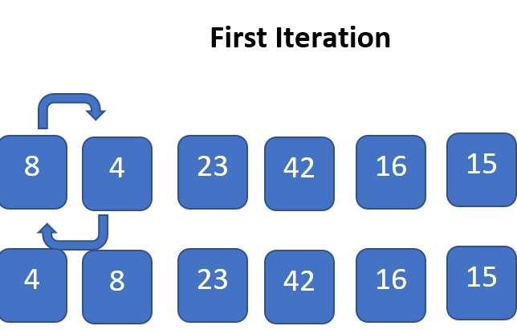
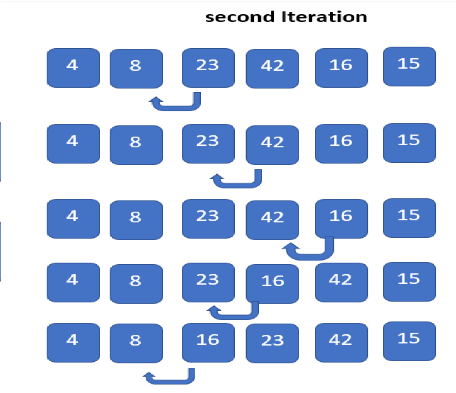
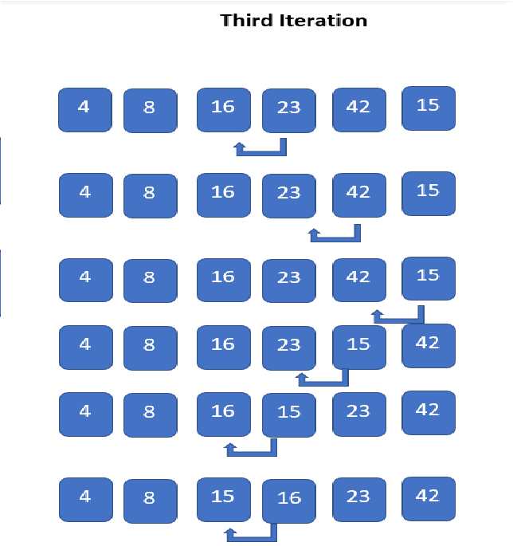
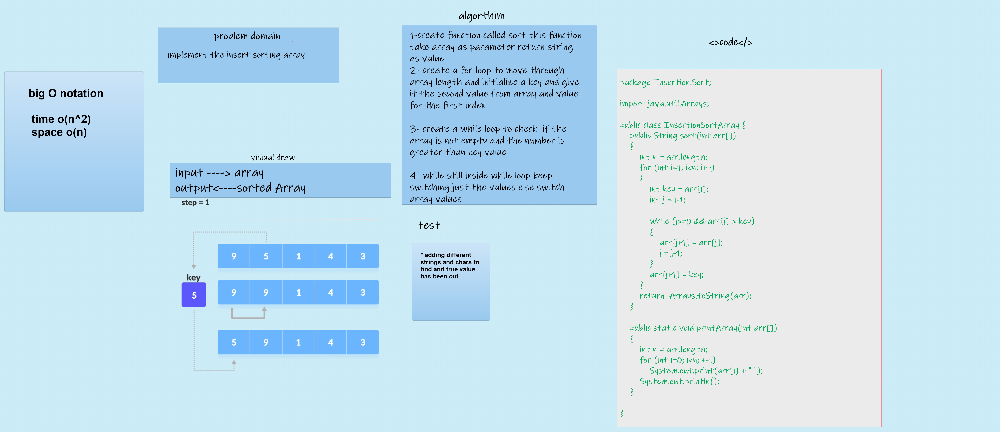

#  Insertion Sort Algorithm

Insertion sort is the sorting mechanism where the sorted array is built having one item at a time. The array elements are compared with each other sequentially and then arranged simultaneously in some particular order. The analogy can be understood from the style we arrange a deck of cards. This sort works on the principle of inserting an element at a particular position, hence the name Insertion Sort.


## Insertion Sort works as follows:

**1-** let's say we have an array so to do the insertion sort algorithm on it we need to break it into two parts part for already soretd elements the other for non-sorted. 

**2-** And we start comparison the elements with elements next to it ,if the element less than the next element,then space is created for it by shifting the other elements one position to the right and inserting the element at the suitable position.

**3-** The above procedure is repeated until all the element in the array is at their apt position.

### Let us know it more with this example:-

Consider the following array: `[8,4,23,42,16,15]`

- First Iteration: Compare 8  with 4 . The comparison shows 4< 8. Hence swap 4 and 8.

The array now looks like:
[4,8,23,42,16,15]



- Second Iteration:

 Begin with the second element (23), but it was already swapped on for the correct position, so we move ahead to the next element.

Now hold on to the third element (42) and compare with the ones preceding it.

Since 42> 23, no swapping takes place.

Also, 23> 8, no swapping takes place and 23 remains at its position.

The array after the Second iteration looks like:

[4,8,23,42,16,15]


- Third Iteration: Start the following Iteration with the 5th element (16), and compare it with its preceding elements.

Since 16< 42, we swap.

Array now becomes: [4,8,23,16,42,15].

But there still exist elements that we haven’t yet compared with 16. Now the comparison takes place between 23 and 16. Since, 16< 23, we swap again.

The array becomes [4,8,16,23,42,15].

The last comparison for the iteration is now between 16 and 8. Since 
8 < 16, we leave it!.




- Fourth Iteration: The last iteration calls for the comparison of the last element (15), with all the preceding elements and make the appropriate swapping between elements.

Since, 15< 42. Swap 15 and 42.

Array now becomes: [4,8,16,23,15,42].

Compare 15 with 23, 16, 8,4.

Since, 15< 23. Swap 23 and 15.

[4,8,16,15,23,42]

Compare 15 with 16 and 8 and 4.

Since, 15<16. Swap 15 and 16.

Array now becomes:

[4,8,15,16,23,42]

The last comparison for the Iteration is to compare 15 with 4 and 8.

Since 15> 4 and 15 > 8 keep as it is.

The array now becomes:

[4,8,15,16,23,42]

This is the final array after all the corresponding iterations and swapping of elements.




## code for this algorithm:-
``` java
package Insertion.Sort;

public class InsertionSortArray {
    public void sort(int arr[])
    {
        int n = arr.length;
        for (int i=1; i<n; i++)
        {
            int key = arr[i];
            int j = i-1;

            while (j>=0 && arr[j] > key)
            {
                arr[j+1] = arr[j];
                j = j-1;
            }
            arr[j+1] = key;
        }
    }
    public static void printArray(int arr[])
    {
        int n = arr.length;
        for (int i=0; i<n; ++i)
            System.out.print(arr[i] + " ");
        System.out.println();
    }

}
```


### the test!
```java
package Insertion.Sort;

import org.junit.jupiter.api.Test;

import static org.junit.jupiter.api.Assertions.*;

class insertTest {
    @Test
    void insertion(){
        InsertionSortArray insertionSortArray=new InsertionSortArray();
        assertEquals("[4, 8, 15, 16, 23, 42]",insertionSortArray.sort(new int[]{8,4,23,42,16,15}));
    }
}
```

### the WhiteBoard process:-


